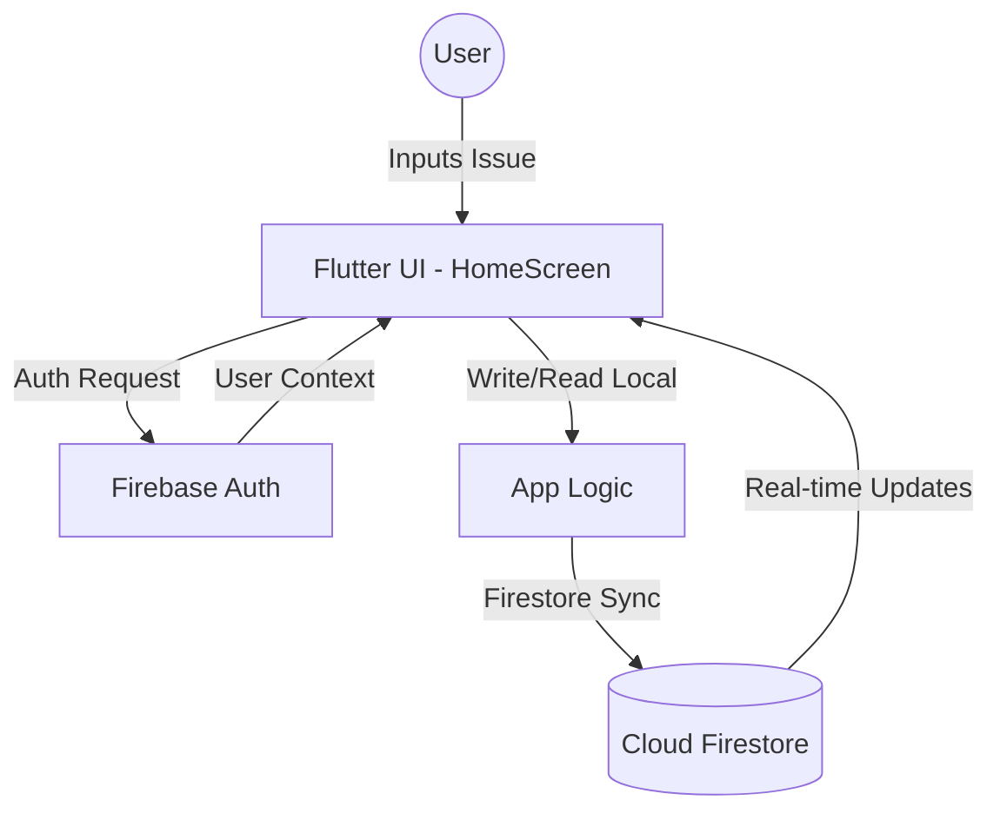

# Architecture Documentation - Hostel Issue Tracker

## A. System Overview
The Hostel Issue Tracker is a cross-platform mobile application built using **Flutter** and **Firebase**. It allows hostel residents to report maintenance issues and track their resolution status in real-time.

### Tech Stack
- **Frontend:** Flutter (Dart)
- **Authentication:** Firebase Auth (Email/Password)
- **Database:** Cloud Firestore (NoSQL)
- **Deployment:** Firebase Hosting (for web) / Flutter Build (for mobile)

---

## B. Directory Structure
```text
lib/
 ┣ screens/          # UI Screens (Login, Home, Welcome)
 ┣ widgets/          # Reusable UI components
 ┣ services/         # Firebase integration logic (Auth, Firestore) - [Planned Refactor]
 ┣ models/           # Data models (Issue, User) - [Planned Refactor]
 ┣ utils/            # Helper functions and constants
 ┣ main.dart         # App entry point
 ┗ firebase_options.dart # Firebase configuration
```

---

## C. Data Flow / System Diagram


---

## D. Firebase Setup and Integration
### 1. Firebase Authentication
- **Method:** Email and Password.
- **Flow:** Users sign up or log in via `login_screen.dart`. Upon success, `FirebaseAuth.instance.currentUser` is used to manage session state.

### 2. Cloud Firestore
- **Collection:** `issues`
- **Document Structure:**
  ```json
  {
    "description": "String",
    "createdAt": "Timestamp",
    "status": "String (Open/Resolved)",
    "userId": "String (UID)"
  }
  ```
- **Security Rules:** (Recommended) Only authenticated users can read/write to the `issues` collection.

---

## E. Deployment and Maintenance
### Build and Deployment
- **Android:** `flutter build apk --release`
- **iOS:** `flutter build ios --release`
- **Web:** `firebase deploy --only hosting`

### Setup for New Contributors
1. Install Flutter SDK.
2. Clone the repository.
3. Run `flutter pub get`.
4. Configure Firebase using `flutterfire configure`.
5. Run the app with `flutter run`.

### Documentation Update Checklist
- [ ] Update [ARCHITECTURE.md](ARCHITECTURE.md) when core folder structure changes.
- [ ] Update Postman Collection in `/docs` when Firestore collections or Auth methods are added/modified.
- [ ] Increment version number in `pubspec.yaml` and documentation.
